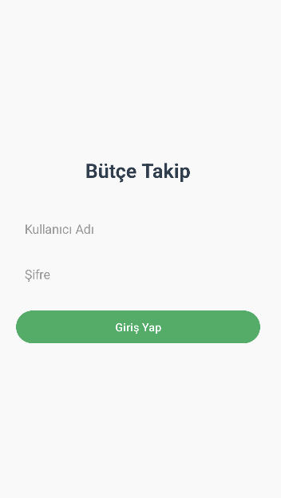
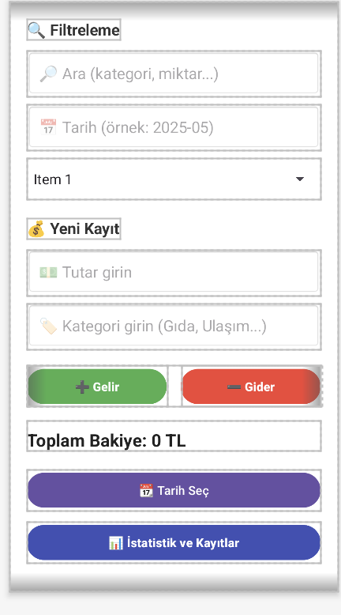
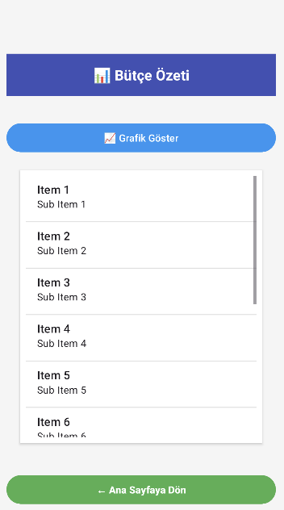

# 💸 Bütçe Takip Uygulaması

Android Studio ve Java ile geliştirilen bu mobil uygulama, kişisel gelir ve giderlerinizi kolayca kaydedip analiz edebileceğiniz modern ve işlevsel bir çözümdür.

## 🔑 Giriş Özelliği

Uygulama giriş ekranı ile sadece belirli kullanıcıların erişimine izin verir. Varsayılan bilgiler:

---

## 🧩 Uygulama Özellikleri

| Özellik                              | Açıklama                                                                 |
|--------------------------------------|--------------------------------------------------------------------------|
| 🔐 Giriş Sistemi                     | Sabit kullanıcı adı / şifre ile tek kullanıcı girişi                     |
| ➕ Gelir & ➖ Gider Kaydı             | Tutar, tarih ve kategori bilgileriyle kolay kayıt ekleme                |
| 📅 Tarih Seçme & Filtreleme         | Belirli bir aya göre kayıt filtreleme                                   |
| 🏷️ Kategoriye Göre Listeleme       | Gıda, ulaşım, eğlence gibi kategorilerle sınıflandırma                   |
| 📊 İstatistik Sayfası               | Toplam gelir, gider ve net bakiye bilgisi                                |
| 🥧 Grafik (Pie Chart) Gösterimi     | Gelir-gider oranını görsel olarak sunan pasta grafik                     |
| ☁️ Firebase Firestore Entegrasyonu | Kayıtların bulut tabanlı veritabanına yazılması (online çalışma desteği) |

---

## 📸 Uygulama Ekran Görselleri

| Giriş Ekranı | Ana Sayfa | Analiz Sayfası |
|-------------|-----------|----------------|
|  |  |  |

---

## 🧠 Kullanılan Teknolojiler

- ✅ Java
- ✅ Android SDK (API 24+)
- ✅ [MPAndroidChart](https://github.com/PhilJay/MPAndroidChart)
- ✅ Firebase Firestore
- ✅ Material Design Bileşenleri

---

📁 Dosya Yapısı

📦 butceTakipApp
├── app/
├── screens/
│   ├── login.png
│   ├── main.png
│   └── analiz.png
├── README.md

👩‍💻 Geliştirici

Zehranur Gülşin
📧 zehranurgulsin@gamil.com

